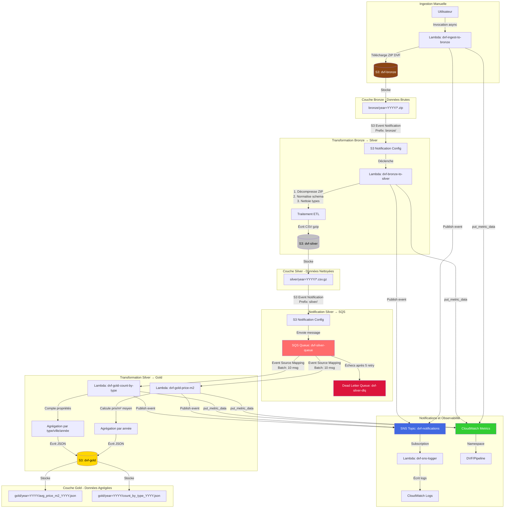

# Architecture du Pipeline DVF

## Vue d'ensemble

Ce document présente l'architecture complète du pipeline DVF, implémentant le pattern **Medallion** (Bronze → Silver → Gold) avec une orchestration **event-driven** basée sur les services AWS simulés par LocalStack.

---

## Architecture Medallion Event-Driven



---

## Description des composants

### 1. Couche Bronze (Données brutes)

**Objectif** : Ingestion et stockage des données brutes DVF au format ZIP.

| Composant | Type | Responsabilité |
|-----------|------|----------------|
| `dvf-ingest-to-bronze` | Lambda | Télécharge les fichiers DVF depuis les URLs officielles |
| `dvf-bronze` | S3 Bucket | Stocke les ZIP dans `bronze/year=YYYY/` |

**Déclenchement** : manuel (invocation asynchrone Lambda).

---

### 2. Transformation Bronze → Silver

**Objectif** : Nettoyage, normalisation et transformation des données.

| Composant | Type | Responsabilité |
|-----------|------|----------------|
| `dvf-bronze-to-silver` | Lambda | Décompresse ZIP, normalise colonnes (snake_case), nettoie types |
| `dvf-silver` | S3 Bucket | Stocke les CSV gzip avec délimiteur `;` |
| S3 Event Notification | Configuration | Déclenche Lambda lors de PUT dans `bronze/` |

**Déclenchement** : automatique via S3 Event Notification.

**Format Silver** :
- CSV gzip
- Délimiteur : `;`
- Colonnes en snake_case
- Types nettoyés (dates, nombres, textes)

---

### 3. Notification Silver → SQS

**Objectif** : Découpler Silver et Gold avec une queue fiable.

| Composant | Type | Responsabilité |
|-----------|------|----------------|
| `dvf-silver-queue` | SQS Queue | Queue FIFO recevant les événements S3 de la couche Silver |
| `dvf-silver-dlq` | SQS DLQ | Capture les messages en échec après 5 tentatives |
| S3 Event Notification | Configuration | Envoie message SQS lors de PUT dans `silver/` |

**Paramètres SQS** :
- `VisibilityTimeout` : 300 secondes (5 min)
- `MaxReceiveCount` : 5 (redirection vers DLQ après 5 échecs)

**Pourquoi SQS ?**
- **Retry automatique** : jusqu'à 5 tentatives en cas d'échec Lambda
- **DLQ** : isole les messages problématiques pour investigation
- **Découplage** : les Lambda Gold peuvent scaler indépendamment
- **Persistance** : messages conservés jusqu'à 14 jours

---

### 4. Transformation Silver → Gold

**Objectif** : Agrégations métier sur données nettoyées.

| Composant | Type | Responsabilité |
|-----------|------|----------------|
| `dvf-gold-price-m2` | Lambda | Calcule le prix moyen au m² par année |
| `dvf-gold-count-by-type` | Lambda | Compte les propriétés vendues par type/ville/année |
| `dvf-gold` | S3 Bucket | Stocke les JSON agrégés |
| Event Source Mapping | Configuration Lambda | Consomme messages SQS avec batch de 10 |

**Déclenchement** : automatique via Event Source Mapping (SQS → Lambda).

**Outputs Gold** :
- `gold/year=2023/avg_price_m2_2023.json`
- `gold/year=2023/count_by_type_2023.json`
- (idem pour 2024 et 2025)

---

### 5. Notifications et Observabilité

**SNS Topic : `dvf-notifications`**

| Composant | Type | Responsabilité |
|-----------|------|----------------|
| `dvf-notifications` | SNS Topic | Point central pour toutes les notifications système |
| `dvf-sns-logger` | Lambda | Subscriber SNS loggant tous les messages |
| CloudWatch Logs | Service | Stocke les logs du Logger |

**Pourquoi SNS ?**
- **Fan-out** : un événement notifie plusieurs subscribers (ici Logger, potentiellement email/Slack)
- **Centralisation** : toutes les notifications passent par un point unique
- **Extensibilité** : ajout facile de nouveaux subscribers sans modifier les producers

**CloudWatch Metrics**

Chaque Lambda publie des métriques custom :

| Métrique | Description |
|----------|-------------|
| `ProcessingTime` | Durée de traitement en ms |
| `RecordsProcessed` | Nombre de lignes/objets traités |
| `ErrorCount` | Nombre d'erreurs rencontrées |

**Namespace** : `DVF/Pipeline`

---

## Flux de données complet

### Scénario nominal

1. **Utilisateur** invoque manuellement `dvf-ingest-to-bronze`
2. **Lambda Ingest** télécharge 3 fichiers ZIP (2023, 2024, 2025) → `s3://dvf-bronze/bronze/year=YYYY/`
3. **S3 Bronze** déclenche 3 fois `dvf-bronze-to-silver` (une fois par ZIP)
4. **Lambda Bronze→Silver** transforme et écrit CSV gzip → `s3://dvf-silver/silver/year=YYYY/`
5. **S3 Silver** envoie 3 messages vers `dvf-silver-queue`
6. **SQS** déclenche 2 Lambda Gold pour chaque message (6 invocations total)
7. **Lambda Gold** agrègent et écrivent JSON → `s3://dvf-gold/gold/year=YYYY/`
8. **Chaque Lambda** publie des événements vers SNS et des métriques vers CloudWatch
9. **Lambda Logger** reçoit tous les événements SNS et les log

### Scénario d'échec

Si un Lambda Gold échoue (bug, timeout, etc.) :

1. **SQS** renvoie le message au Lambda (retry)
2. Après **5 tentatives**, le message est déplacé vers `dvf-silver-dlq`
3. **Alerte** : inspection manuelle de la DLQ pour identifier le problème
4. **Correction** : fix du code Lambda, puis retraitement manuel du message DLQ

---

## Gestion des erreurs

### Timeouts

- **Bronze→Silver** : timeout de 300s (5 min) pour traiter les gros fichiers ZIP
- **Gold** : timeout de 120s (2 min) pour les agrégations

### Retries

- **SQS** : retry automatique jusqu'à 5 fois avec exponential backoff
- **DLQ** : capture les messages définitivement en échec

### Monitoring

- **CloudWatch Metrics** : dashboards pour visualiser `ErrorCount`, `ProcessingTime`
- **CloudWatch Logs** : logs structurés pour chaque Lambda
- **SNS Logger** : historique centralisé des événements

---

## Partitionnement des données

Le pipeline utilise un partitionnement par **année** pour optimiser les requêtes :

```
dvf-bronze/
  bronze/
    year=2023/
      dvf_2023.zip
    year=2024/
      dvf_2024.zip
    year=2025/
      dvf_2025.zip

dvf-silver/
  silver/
    year=2023/
      dvf_2023_clean.csv.gz
    year=2024/
      dvf_2024_clean.csv.gz
    year=2025/
      dvf_2025_clean.csv.gz

dvf-gold/
  gold/
    year=2023/
      avg_price_m2_2023.json
      count_by_type_2023.json
    year=2024/
      avg_price_m2_2024.json
      count_by_type_2024.json
    year=2025/
      avg_price_m2_2025.json
      count_by_type_2025.json
```

**Avantages** :
- Lectures ciblées par année
- Évite le scan complet du bucket
- Compatible avec les outils d'analyse (Athena, Glue, etc.)

---

## Sécurité et IAM

### Principes

- **Least privilege** : chaque Lambda a uniquement les permissions nécessaires
- **Roles dédiés** : un rôle IAM par Lambda
- **Policies inline** : définies dans Terraform pour traçabilité

### Permissions principales

| Lambda | Permissions |
|--------|-------------|
| `dvf-ingest-to-bronze` | `s3:PutObject` sur `dvf-bronze`, `sns:Publish`, `cloudwatch:PutMetricData` |
| `dvf-bronze-to-silver` | `s3:GetObject` sur `dvf-bronze`, `s3:PutObject` sur `dvf-silver`, `sns:Publish`, `cloudwatch:PutMetricData` |
| `dvf-gold-*` | `s3:GetObject` sur `dvf-silver`, `s3:PutObject` sur `dvf-gold`, `sqs:ReceiveMessage`, `sqs:DeleteMessage`, `sns:Publish`, `cloudwatch:PutMetricData` |
| `dvf-sns-logger` | `logs:CreateLogGroup`, `logs:CreateLogStream`, `logs:PutLogEvents` |

---

## Scalabilité

### Limites LocalStack

- **Lambda concurrent executions** : limité par les ressources Docker
- **SQS throughput** : ~300 msg/s (simulé)
- **S3 operations** : pas de limite pratique

### Scalabilité en production AWS

- **Lambda** : scale automatiquement jusqu'à 1000 exécutions concurrentes (ou plus)
- **SQS** : throughput illimité (Standard Queue) ou 300 msg/s (FIFO)
- **S3** : 3500 PUT/s et 5500 GET/s par préfixe

---

## Évolutions possibles

1. **Glue Data Catalog** : crawler Glue pour cataloguer automatiquement les données Silver/Gold
2. **Athena** : requêtes SQL ad-hoc sur les CSV gzip Silver
3. **Step Functions** : orchestration visuelle du pipeline avec retry/branching
4. **EventBridge** : remplacer SNS pour routing complexe d'événements
5. **DynamoDB** : indexation des métadonnées (nombre de lignes, checksums, etc.)
6. **API Gateway + Lambda** : exposition des données Gold via API REST

---

## Références

- [AWS Lambda Best Practices](https://docs.aws.amazon.com/lambda/latest/dg/best-practices.html)
- [Medallion Architecture](https://www.databricks.com/glossary/medallion-architecture)
- [Event-Driven Architecture on AWS](https://aws.amazon.com/event-driven-architecture/)
- [LocalStack Documentation](https://docs.localstack.cloud/)
- [DVF Open Data](https://www.data.gouv.fr/fr/datasets/demandes-de-valeurs-foncieres/)

---

**Date** : Décembre 2025
